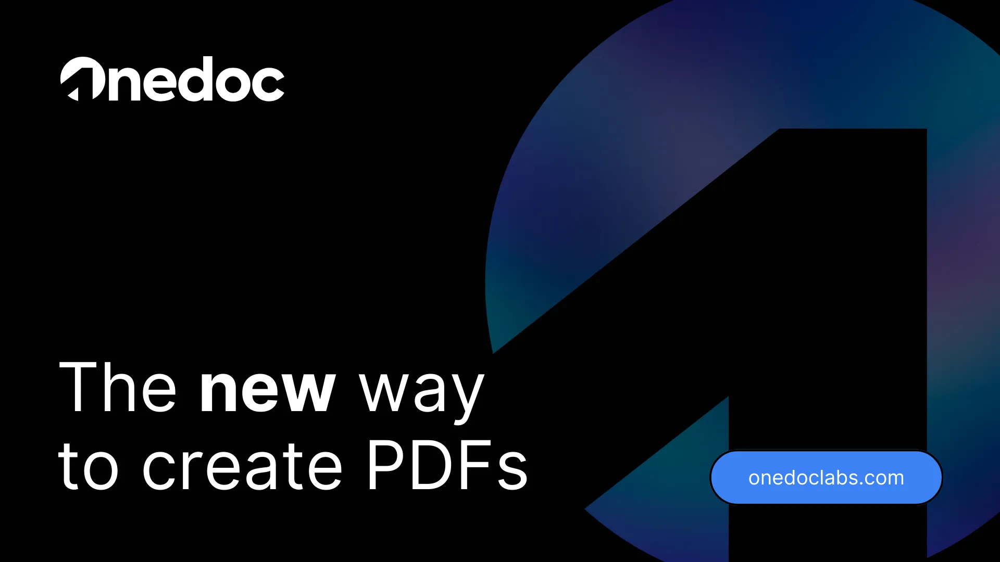

<div align="left">

[](https://onedoc.com)

# [Onedoc](https://onedoc.com)

Onedoc is an innovative API solution for developers, offering a simple and secure way to create and manage PDF documents using familiar technologies like React.

</div>

## Requirements

Building the API client library requires:

1. Java 1.8+
2. Maven (3.8.3+)/Gradle (7.2+)

If you are adding this library to an Android Application or Library:

3. Android 8.0+ (API Level 26+)

## Installation<a id="installation"></a>
<div align="center">
  <a href="https://konfigthis.com/sdk-sign-up?company=OneDoc&language=Java">
    
  </a>
</div>

### Maven users

Add this dependency to your project's POM:

```xml
<dependency>
  <groupId>com.konfigthis</groupId>
  <artifactId>one-doc-java-sdk</artifactId>
  <version>1.0</version>
  <scope>compile</scope>
</dependency>
```

### Gradle users

Add this dependency to your `build.gradle`:

```groovy
// build.gradle
repositories {
  mavenCentral()
}

dependencies {
   implementation "com.konfigthis:one-doc-java-sdk:1.0"
}
```

### Android users

Make sure your `build.gradle` file as a `minSdk` version of at least 26:
```groovy
// build.gradle
android {
    defaultConfig {
        minSdk 26
    }
}
```

Also make sure your library or application has internet permissions in your `AndroidManifest.xml`:

```xml
<!--AndroidManifest.xml-->
<?xml version="1.0" encoding="utf-8"?>
<manifest xmlns:android="http://schemas.android.com/apk/res/android"
    xmlns:tools="http://schemas.android.com/tools">
    <uses-permission android:name="android.permission.INTERNET"/>
</manifest>
```

### Others

At first generate the JAR by executing:

```shell
mvn clean package
```

Then manually install the following JARs:

* `target/one-doc-java-sdk-1.0.jar`
* `target/lib/*.jar`

## Getting Started

Please follow the [installation](#installation) instruction and execute the following Java code:

```java
import com.konfigthis.client.ApiClient;
import com.konfigthis.client.ApiException;
import com.konfigthis.client.ApiResponse;
import com.konfigthis.client.OneDoc;
import com.konfigthis.client.Configuration;
import com.konfigthis.client.auth.*;
import com.konfigthis.client.model.*;
import com.konfigthis.client.api.DocumentApi;
import java.util.List;
import java.util.Map;
import java.util.UUID;

public class Example {
  public static void main(String[] args) {
    Configuration configuration = new Configuration();
    configuration.host = "https://app.onedoclabs.com";
    
    configuration.apiKeyAuth  = "YOUR API KEY";
    OneDoc client = new OneDoc(configuration);
    String title = "document"; // The title of the PDF, defaults to \\\"document\\\".
    String bucket = "bucket_example"; // The identifier of the bucket.
    String password = "password_example"; // The password of the bucket.
    String username = "username_example"; // The username of the bucket.
    Boolean test = true; // Whether or not to generate a test PDF, defaults to true.
    Boolean save = false; // Whether or not to save the PDF to the bucket, defaults to false.
    Integer expiresIn = 56; // The expiration time of the PDF in days, default is 1 day.
    try {
      File result = client
              .document
              .generatePdfFromBucket()
              .title(title)
              .bucket(bucket)
              .password(password)
              .username(username)
              .test(test)
              .save(save)
              .expiresIn(expiresIn)
              .execute();
    } catch (ApiException e) {
      System.err.println("Exception when calling DocumentApi#generatePdfFromBucket");
      System.err.println("Status code: " + e.getStatusCode());
      System.err.println("Reason: " + e.getResponseBody());
      System.err.println("Response headers: " + e.getResponseHeaders());
      e.printStackTrace();
    }

    // Use .executeWithHttpInfo() to retrieve HTTP Status Code, Headers and Request
    try {
      ApiResponse<File> response = client
              .document
              .generatePdfFromBucket()
              .title(title)
              .bucket(bucket)
              .password(password)
              .username(username)
              .test(test)
              .save(save)
              .expiresIn(expiresIn)
              .executeWithHttpInfo();
      System.out.println(response.getResponseBody());
      System.out.println(response.getResponseHeaders());
      System.out.println(response.getStatusCode());
      System.out.println(response.getRoundTripTime());
      System.out.println(response.getRequest());
    } catch (ApiException e) {
      System.err.println("Exception when calling DocumentApi#generatePdfFromBucket");
      System.err.println("Status code: " + e.getStatusCode());
      System.err.println("Reason: " + e.getResponseBody());
      System.err.println("Response headers: " + e.getResponseHeaders());
      e.printStackTrace();
    }
  }
}

```

## Documentation for API Endpoints

All URIs are relative to *https://app.onedoclabs.com*

Class | Method | HTTP request | Description
------------ | ------------- | ------------- | -------------
*DocumentApi* | [**generatePdfFromBucket**](docs/DocumentApi.md#generatePdfFromBucket) | **POST** /api/docs/generate | Generates a PDF from a specified bucket.
*DocumentApi* | [**renderingBucket**](docs/DocumentApi.md#renderingBucket) | **POST** /api/docs/initiate | Initiates a document&#39;s rendering


## Documentation for Models

 - [DocumentGeneratePdfFromBucketRequest](docs/DocumentGeneratePdfFromBucketRequest.md)
 - [DocumentRenderingBucketRequest](docs/DocumentRenderingBucketRequest.md)
 - [DocumentRenderingBucketRequestAssetsInner](docs/DocumentRenderingBucketRequestAssetsInner.md)
 - [DocumentRenderingBucketResponse](docs/DocumentRenderingBucketResponse.md)
 - [DocumentRenderingBucketResponseSignedUrlsInner](docs/DocumentRenderingBucketResponseSignedUrlsInner.md)


## Author
This Java package is automatically generated by [Konfig](https://konfigthis.com)
